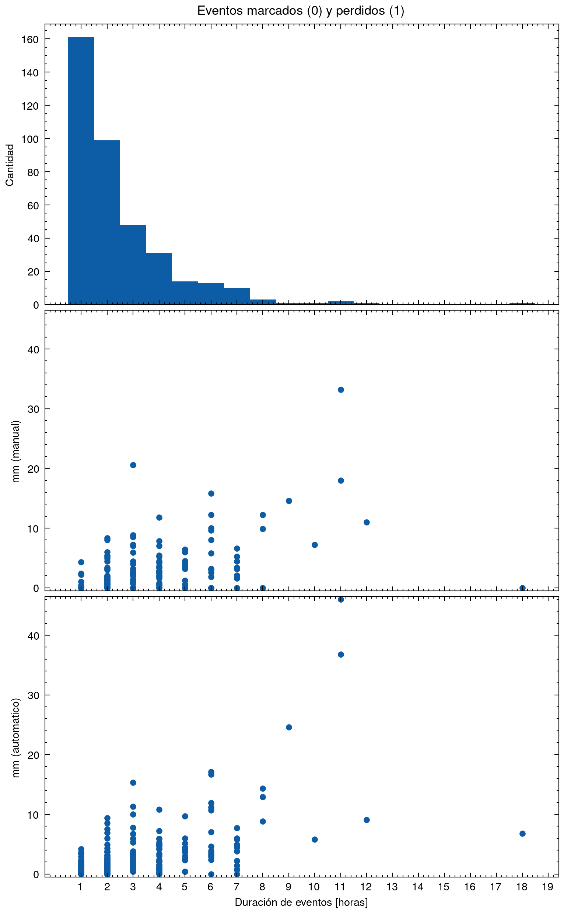

# pluvio-chc
Análisis de datos del pluviómetro manual y automático en CHC

## Productos
### 1. Todos los eventos (`outputs/all_events.csv`)
Tabla resumida de todos los eventos, cuenta con columnas

 - **fecha**: Fecha
 - **fechahora**: Fecha y hora de inicio de evento
 - **duracion**: Duración de evento (en horas, incluye la hora inicial)
 - **pluvio**: Medida en mm manual
 - **precip**: Medida en mm automatico
 - **observador**: Observador del día de inicio (nota: tomar esto en cuenta en eventos de duración de más de un día).
 - **tipo**: Tipo de evento, toma los valores:
  - `0`: Evento marcado por el observador (pluvio > 0)
  - `1`: Evento _perdido_ (precip > 0 y pluvio = 0)
  - `2`: Evento no registrado (precip = pluvio = 0)

## Resultados

Primera comparación entre la duración de eventos, los mm marcados por los observadores y los mm por el automático.